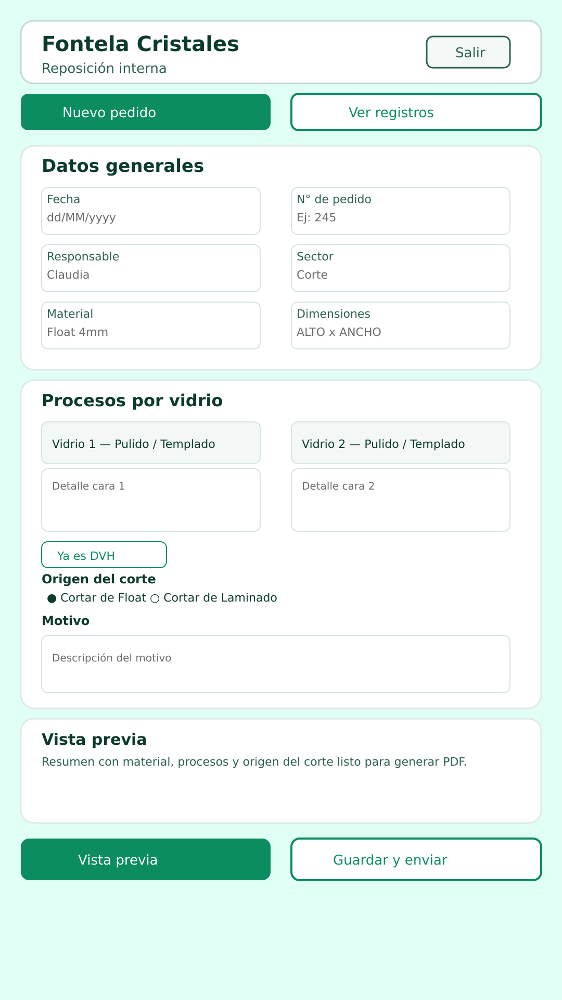

# Reposición Interna

Aplicación Android para gestionar pedidos de reposición de cristales: captura de datos, control de procesos por cara y vista previa del PDF antes de guardarlo y enviarlo por correo.

## Vista previa de la pantalla principal

La maqueta muestra todos los controles en una sola vista (también en rotación) con botones de **Vista previa** y **Guardar y enviar**, selección de procesos para Cara 1 y Cara 2 (Pulido y Templado), campo de motivo y opciones de origen del corte. Al **Guardar y enviar** se limpia el formulario para ingresar un nuevo registro y evitar duplicados.

## Datos maestros

La app carga los maestros desde `app/src/main/assets/maestros_reposicion.csv` para poblar Material, Responsable y Sector. Podés editar ese archivo con tus valores o reemplazarlo por uno exportado desde tu sistema actual (formato `Material;Responsable;Sector`).
